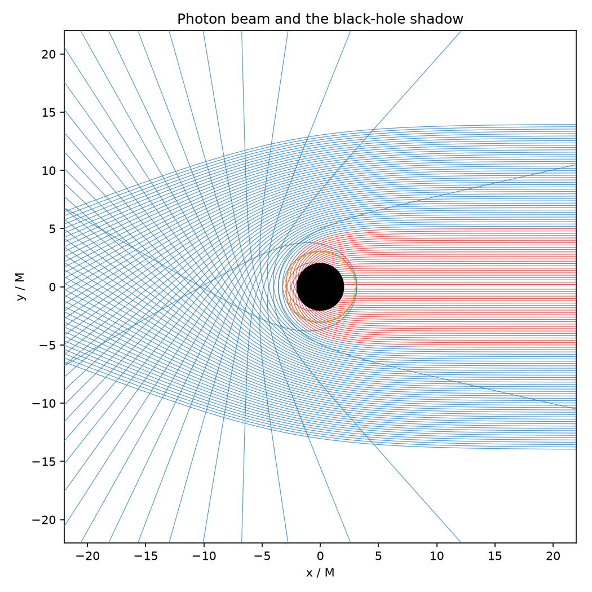

# black-hole-ml

A C++ black-hole geodesic simulator paired with machine-learning models trained on its output.

The project models light and matter around Schwarzschild and Kerr black holes with an
efficient C++ core, then trains neural models on the generated data:

- a **capture classifier** (is a photon captured or does it escape?),
- a **deflection-angle surrogate** (fast regression replacing the integrator),
- a **Fourier Neural Operator** mapping accretion-disk emission to ray-traced images, and
- a **CNN inverse model** that recovers spin and inclination from an image.

Physics runs in C++ (OpenMP, optional CUDA); the models and data pipelines are in Python
(PyTorch). GPU-bound work runs in a Kaggle notebook that clones this repo; everything else
runs on CPU. The Fourier Neural Operator is implemented from scratch in this repo; the
companion repository [`fno-pde`](https://github.com/amark-23/fno-pde) is kept only as a
reference for the approach, not as a dependency.



*A beam of photons past a Schwarzschild black hole: rays with |b| < 3√3 M are captured (red),
carving out the shadow; the rest bend around it. More in [sim/README.md](sim/README.md).*

## Layout

```
sim/        C++ core: metrics, integrators, ray tracing (CMake, OpenMP, optional CUDA)
bhml/       Python package: data generation, models, training, visualization
matlab/     symbolic derivations and reference-trajectory fixtures (dev-time only)
configs/    run configurations
notebooks/  Kaggle notebooks for GPU work
docs/       figures and notes
```

## Documentation

- **[sim/README.md](sim/README.md)** — the Schwarzschild simulator: how to build it, run
  the tests, generate orbits from the CLI, use the Python bindings, and the full gallery.
- **[bhml/README.md](bhml/README.md)** — the ML models: the capture classifier and the
  deflection surrogate, how to generate their data and train them, with results.
- **[THEORY.md](THEORY.md)** — the physics and numerics: metric, geodesic equations,
  Runge–Kutta integration, and the analytic checkpoints the code is tested against.

## Status

Phases 1–4 complete:

- **Schwarzschild integrator** — RK4 and adaptive Dormand–Prince RK45, validated against
  the analytic checkpoints (critical impact parameter, photon sphere, ISCO, weak-field
  deflection) plus first integrals; CLI, Python bindings, and visualization.
- **Capture classifier** — recovers `b_crit = 3√3 M` from labeled data (~99.9% accuracy).
- **Deflection surrogate** — regresses the deflection angle to ~1.4% error, ~200× faster
  than the integrator.
- **Kerr integrator** — full 3-D Hamiltonian geodesics for spinning black holes, metric
  derivatives derived in MATLAB; matches a MATLAB `ode113` reference to ~1e-11 and reduces
  to Schwarzschild at `a = 0`. Frame dragging visualized as an asymmetric shadow.

Ray tracing and the FNO / inverse-problem models follow.
