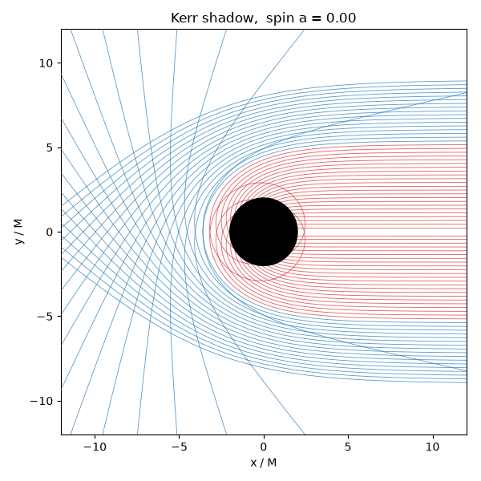

# black-hole-ml

Simulating a black hole from scratch, and teaching neural networks to predict
what it does.

The project has parts:

- [`simulation/`](simulation) models the black hole itself: a C++ engine that
  traces light and matter around Schwarzschild (non-rotating) and Kerr (spinning)
  black holes, validated against known physics and drawn as orbits, shadows, and
  animations.
- [`ml/`](ml) trains machine-learning models on the simulator's output: a
  classifier that rediscovers the capture threshold, and a surrogate that predicts
  light bending hundreds of times faster than integrating it.



*As a black hole spins faster, frame dragging pulls its shadow off-center. A
richer three-dimensional render is tba.*

## Quick install

You need a C++17 compiler with CMake (on Windows, the Visual Studio Build Tools
with the C++ workload) and Python 3.10+.

```
# 1. build and test the simulator
cmake -S simulation -B simulation/build
cmake --build simulation/build --config Release
ctest --test-dir simulation/build --output-on-failure

# 2. set up Python (for the plots and the ML)
python -m venv .venv
.venv\Scripts\activate            # Windows;  source .venv/bin/activate elsewhere
pip install -e ".[dev]"
```

From here, [`simulation/README.md`](simulation/README.md) shows how to generate
orbits and figures, and [`ml/README.md`](ml/README.md) shows how to generate data
and train the models. Each README carries the relevant physics and the commands
together.

## The simulator

A geodesic integrator built up from the simplest black hole to a spinning one:

- **Schwarzschild** orbits from a smooth second-order form of the equations of
  motion, advanced with RK4 and adaptive Dormand-Prince RK45.
- **Kerr** orbits in full three dimensions, from Hamilton's equations, with the
  messy metric derivatives derived symbolically in MATLAB and exported to C++.
- Checked against the analytic landmarks (photon sphere, critical impact
  parameter, ISCO, weak-field deflection) and, for Kerr, against an independent
  MATLAB reference that it matches to about one part in $10^{11}$.

## The machine learning

Small models trained on data the simulator produces:

- **Capture classifier**: recovers the capture threshold $b_\text{crit} = 3\sqrt3\,M$
  from labeled examples, to about 99.9% accuracy.
- **Deflection surrogate**: predicts light bending to about 1.4% error while
  running roughly 200 times faster than the integrator.

## Layout

```
simulation/   C++ engine, tests, MATLAB derivation, plotting/animation, figures
ml/           Python package (models, data, training), notebooks, figures
```
