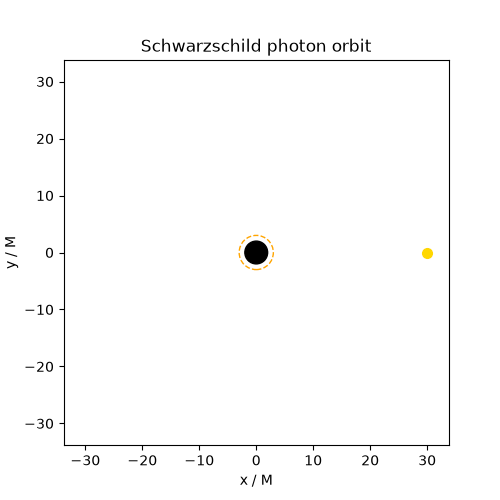

# black-hole-ml

A C++ black-hole geodesic simulator paired with machine-learning models trained on its output.

The project models light and matter around Schwarzschild and Kerr black holes with an
efficient C++ core, then trains neural models on the generated data:

- a **capture classifier** (is a photon captured or does it escape?),
- a **deflection-angle surrogate** (fast regression replacing the integrator),
- a **Fourier Neural Operator** mapping accretion-disk emission to ray-traced images, and
- a **CNN inverse model** that recovers spin and inclination from an image.

Physics runs in C++ (OpenMP, optional CUDA); the models and data pipelines are in Python
(PyTorch). GPU-bound work runs in a Kaggle notebook that clones this repo; everything else
runs on CPU. The Fourier Neural Operator is implemented from scratch in this repo; the
companion repository [`fno-pde`](https://github.com/amark-23/fno-pde) is kept only as a
reference for the approach, not as a dependency.

See [`THEORY.md`](THEORY.md) for the physics and the equations.

## Layout

```
sim/        C++ core: metrics, integrators, ray tracing (CMake, OpenMP, optional CUDA)
bhml/       Python package: data generation, models, training
matlab/     symbolic derivations and reference-trajectory fixtures (dev-time only)
configs/    run configurations
notebooks/  Colab notebooks for GPU work
tests/      C++ tests live in sim/tests
```

## Building and running

### Prerequisites

- A C++17 compiler and CMake. On Windows, the Visual Studio 2022 **Build Tools**
  (C++ workload) provide both — build from the **Developer Command Prompt for
  VS 2022**. On Linux/macOS, any recent g++/clang and cmake.
- Python 3.10+ for the plotting (and, later, the ML code).

### Build the simulator and run the tests

From the repo root:

```
cmake -S sim -B sim/build
cmake --build sim/build --config Release
ctest --test-dir sim/build --output-on-failure
```

The tests validate the integrator against analytic results (critical impact
parameter, photon sphere, ISCO, weak-field deflection, first integrals). The
executable lands at `sim/build/Release/bhsim.exe` (Windows) or
`sim/build/bhsim` (Linux/macOS).

### Generate trajectories (CLI)

`bhsim` writes a trajectory as CSV to stdout; status goes to stderr, so only the
data reaches the file:

```
bhsim photon 6 30              > orbit.csv     # photon, b=6, start r0=30  (escapes)
bhsim photon 5.3 30            > whirl.csv     # just above b_crit         (whirls, escapes)
bhsim photon 4 30              > capture.csv   # below b_crit              (captured)
bhsim massive 0.97 4.0 20 1500 > rosette.csv   # bound orbit: E, L, r0, lambda_max
```

On Windows, prefix with the path: `.\sim\build\Release\bhsim.exe photon 6 30 > orbit.csv`.

### Python environment

```
python -m venv .venv
.venv\Scripts\activate         # Windows;  source .venv/bin/activate elsewhere
pip install -e ".[dev]"        # numpy, matplotlib, imageio, pytest, ruff
```

Activate the venv in each new terminal (look for the `(.venv)` prefix).

### Make the figures

```
python bhml/plot_orbit.py orbit.csv      # -> docs/figures/orbit.png
python bhml/plot_fan.py                    # -> docs/figures/fan.png  (the shadow)
python bhml/animate_orbit.py whirl.csv     # -> docs/figures/whirl.gif
```

`plot_fan.py` locates the built `bhsim` automatically and fires a beam of rays.

### Optional: Python bindings

To call the integrator directly from Python instead of via the CLI, build the
pybind11 module (fetches pybind11 on first configure — needs internet; run from
the activated venv so it finds your Python):

```
cmake -S sim -B sim/build -DBHSIM_PYTHON=ON
cmake --build sim/build --config Release
```

This places the `_bhsim` extension inside `bhml/`. Then, from the repo root:

```python
from bhml.sim import trace_photon, trace_massive
traj, outcome = trace_photon(6.0, r0=30.0)
x, y = traj["x"], traj["y"]      # numpy arrays
```

## Gallery


**Deflected photon orbit.** A single photon with impact parameter *b* = 6*M*
grazing the black hole and escaping, its path bent by gravity. Black disk: event
horizon (*r* = 2*M*). Dashed ring: photon sphere (*r* = 3*M*).
Regenerate with `bhsim 6 30 > orbit.csv` then `python bhml/plot_orbit.py orbit.csv`.


**The shadow.** A parallel beam of 141 photons. Red rays
(|*b*| < 3√3 *M* ≈ 5.196) are captured, carving out the dark shadow; rays just
outside it whirl around the photon sphere; the rest bend away.
Regenerate with `python bhml/plot_fan.py`.



**Photon whirl.** A photon at *b* = 5.3*M*, just above the critical value, winds
several times around the photon sphere before escaping.
Regenerate with `bhsim 5.3 30 > whirl.csv` then
`python bhml/animate_orbit.py whirl.csv`.

## Status

Phase 1 — Schwarzschild geodesic integrator complete: RK4 and adaptive
Dormand–Prince RK45, validated against the analytic checkpoints (critical impact
parameter, photon sphere, ISCO, weak-field deflection) plus first integrals.
CLI and visualization in place. Kerr, ray tracing, and the ML models follow.
