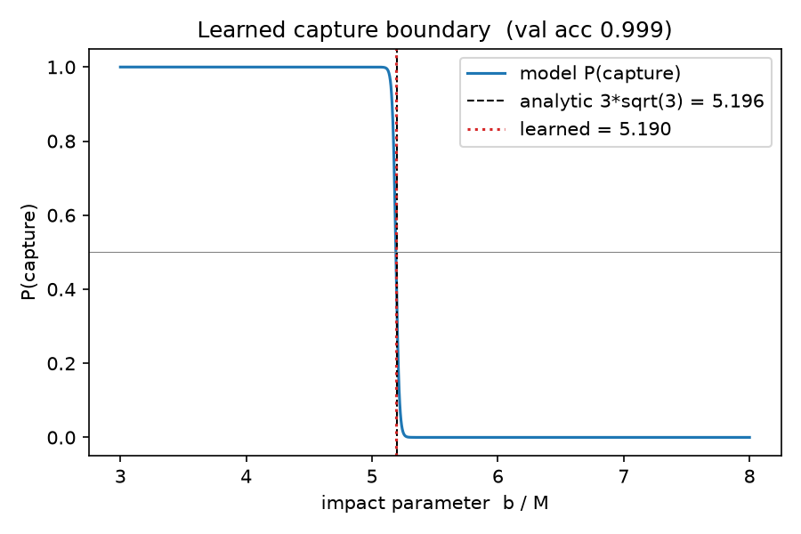
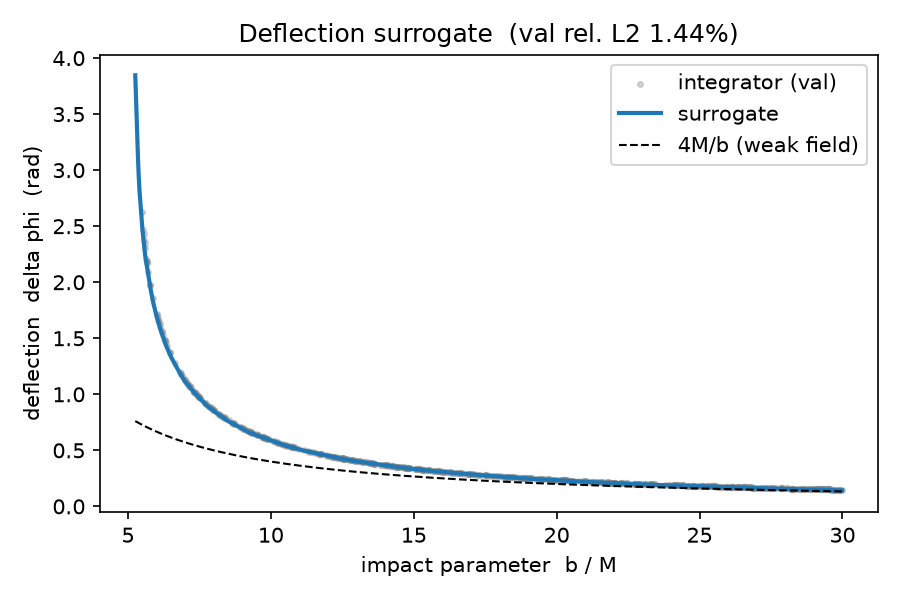
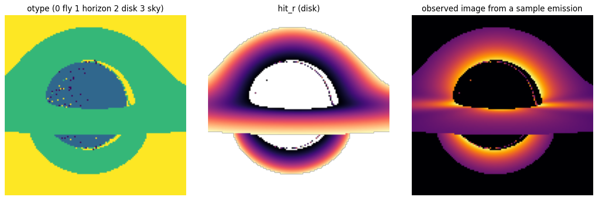
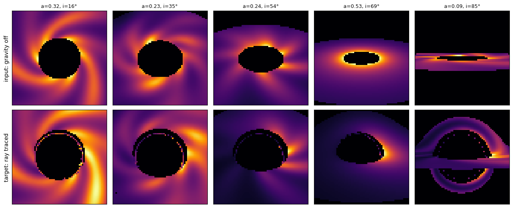
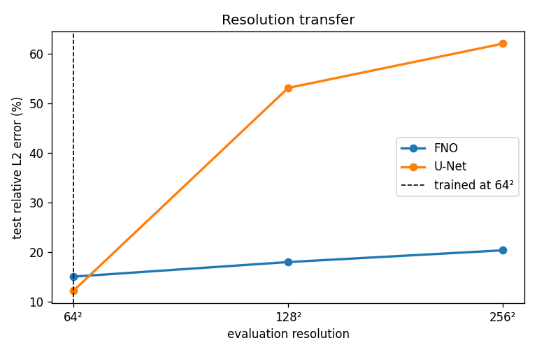
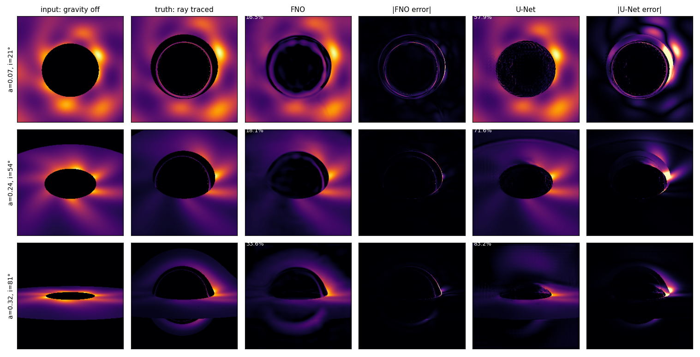

# Machine learning on the black hole

Neural models trained on data from the simulator in [`../simulation`](../simulation).
The idea is to let a network learn the input-to-output map that the physics
defines, then use it either as a fast stand-in for the integrator or to solve
problems the integrator cannot solve directly (like reading spin off an image).

Each task follows the same shape: generate a dataset by running the simulator,
train a small model, and check what it learned against the physics.

## Setup

```
python -m venv .venv
.venv\Scripts\activate                                    # Windows
pip install -e ".[dev]"
pip install torch --index-url https://download.pytorch.org/whl/cpu
```

The data generators call the simulator through its Python bindings, so build the
`_bhsim` extension once (see the "Calling the simulator from Python" section of
the [simulation README](../simulation/README.md)). CPU PyTorch is plenty; the
models here are tiny.

The package is imported as `bhml` (it lives at `ml/bhml`). Run everything from the
repo root, for example `python -m bhml.data capture`.

## Capture classifier

The first task: from a photon's starting conditions, predict whether it is
captured or escapes. This is a binary classification problem.

For a non-rotating hole the answer depends only on the impact parameter: a photon
is captured exactly when $b < b_\text{crit} = 3\sqrt3\,M$. So a model trained on
$b$ should discover a decision boundary sitting at $3\sqrt3 \approx 5.196$. We
also feed it the start radius $r_0$ as a decoy, since capture does not depend on
it, to see whether the model correctly learns to ignore an irrelevant input.

This task is deliberately easy. Its value is twofold: it exercises the whole
pipeline end to end (simulator, dataset, training, evaluation), and it lets the
physics grade the result. If the learned boundary lands on $3\sqrt3$, both the
integrator and the training loop are working.

```
python -m bhml.data capture      # -> data/capture.npz
python -m bhml.train capture     # -> ml/figures/capture_boundary.png, checkpoint
```

Result: about 99.9% validation accuracy; the learned boundary sits at roughly
5.19 against the analytic 5.196; and the boundary barely moves as $r_0$ varies,
so the decoy is ignored.

<p align="center">
  
</p>

## Deflection surrogate

The second task: predict a photon's total deflection angle $\delta\varphi$ from
its impact parameter (for escaping photons, $b > b_\text{crit}$). This is a
regression, and the target spans two very different regimes:

- far out ($b \gg b_\text{crit}$) the bending is gentle, $\delta\varphi \to 4M/b$,
  Einstein's weak-field result;
- close to the threshold ($b \to b_\text{crit}$) the deflection diverges like
  $-\ln(b - b_\text{crit})$, because the photon whirls many times around the
  photon sphere before escaping.

A trained surrogate returns the deflection far faster than integrating the
geodesic, which is the point: pay the integration cost once to build the dataset,
then evaluate almost for free afterward.

```
python -m bhml.data deflection   # -> data/deflection.npz
python -m bhml.train deflection  # -> ml/figures/deflection_fit.png, checkpoint, speed benchmark
```

Result: about 1.4% relative L2 error across the whole range, and roughly 200 times
faster than the integrator (batched inference).

<p align="center">
  
</p>

## Kerr lensing dataset

The next two tasks share one dataset of ray-traced Kerr black holes, published on
Kaggle as [**kerr-lensing**](https://www.kaggle.com/datasets/markopolo2310/kerr-lensing).

It holds 2,000 black holes, with spin $a$ drawn uniformly from $[0, 0.99]$ and
viewing inclination from $[15°, 85°]$, each traced at 128×128 by the GPU ray tracer
in [`simulation/viz/gpu_render.py`](../simulation/viz/gpu_render.py). The framing
is fixed (camera at $40M$, 30° field of view), so every sample shares one image
domain and only the physics changes. The disk runs from the ISCO out to $18M$.

Rather than finished pictures, it stores where every pixel's light ray ended up:

| field | meaning |
| --- | --- |
| `otype` | outcome of the ray: 1 horizon (the shadow), 2 disk, 3 sky, 0 unfinished |
| `hit_r`, `hit_ph` | where the ray crossed the disk, $(r, \varphi)$ |
| `hit_g` | redshift factor $g$ at that crossing (Doppler + gravitational) |
| `sky_th`, `sky_ph` | the direction an escaping ray heads off to on the sky |
| `params` | $(a, \text{inclination})$ of each black hole |
| `split` | train / val / test, 80/10/10 |

Those fields *are* the black hole's lensing map. Push any disk emission profile
$E(r, \varphi)$ through them (`emission_to_image` in
[`datagen/lensing.py`](datagen/lensing.py)) and out comes the observed image, so a
single trace yields unlimited (emission, image) pairs. Pass `hit_g` as well to
include the relativistic shift: the observed brightness is $g^4$ times the
emitted one, so gas moving toward the camera is boosted and gas moving away is
dimmed.

<p align="center">
  
</p>

*One sample ($a = 0.63$, inclination $83°$): the outcome of every pixel's ray, the
disk radius it hit, and the observed image formed by pushing a sample emission
profile through that geometry, with its $g^4$ shift (the approaching side, on the
right, is brighter).*

The data comes from [`notebooks/dataset_lensing_kaggle.ipynb`](notebooks/dataset_lensing_kaggle.ipynb)
(about two minutes on a Kaggle T4), as eight float16 `npz` shards plus a
`manifest.json` describing the schema. In a Kaggle notebook, use **Add Data →
kerr-lensing**, then:

```python
import glob, numpy as np
shards = sorted(glob.glob("/kaggle/input/kerr-lensing/**/shard_*.npz", recursive=True))
z = np.load(shards[0])   # otype, hit_r, hit_ph, hit_g, sky_th, sky_ph, params, split
```

## Emission to image: a Fourier Neural Operator

The function-to-function task, and the one place the
[`fno-pde`](https://github.com/amark-23/fno-pde) models apply directly: its
from-scratch FNO and its U-Net baseline carry over, now mapping one image to
another. Resolution transfer is the headline: high-resolution ray tracing is
expensive, so a model trained on cheap 64² images that holds up at 256² is a real
payoff, not just a benchmark.

<p align="center">
  
</p>

*The task, from face-on to edge-on. Top: a disk emission profile seen with gravity
switched off. Bottom: the same emission through the ray-traced geometry of that
black hole, which is what the models learn to produce.*

**The input.** An FNO maps a field on a grid to a field on the same grid, so the
emission profile $E(r, \varphi)$ is shown to it the way the camera would see it with
gravity switched off: a straight-line projection of the disk onto the ray tracer's
own pixels (`flat_disk_view` in [`bhml/lensing_data.py`](bhml/lensing_data.py),
pinned to the tracer's camera by a test against a weak-field trace). The target is
the ray-traced image, $g^4 E$ at each pixel's disk crossing. Input and output share
one image domain at every resolution, and what the model learns is exactly what
gravity adds: the bending, the far side lifted over the shadow, the photon ring,
the shadow itself, and the Doppler beaming.

- **FNO2d** ([`bhml/models.py`](bhml/models.py)): five input channels, that field,
  spin, inclination, and the pixel coordinates $(x, y)$, since the map is not
  translation-invariant (the photon ring sits at a fixed place). Images are not
  periodic, so the domain is padded by an eighth on each axis before the Fourier
  layers; padding by a fraction keeps it the same physical size at every
  resolution. 12 Fourier modes, width 32, 4 layers.
- **U-Net baseline** with the same inputs, at a matched parameter count (2.37M and
  2.28M real-valued parameters).
- **Training** ([`bhml/fno_lensing.py`](bhml/fno_lensing.py)): 1,600 black holes at
  64², 300 epochs, relative L2 loss and Adam, with a fresh random emission profile
  (a power law with streaks, spirals and hot spots) for every black hole every
  epoch, and fixed profiles for validation and testing.
- **Resolution transfer**: the same 200 test black holes, never seen in training,
  with the same emission profiles, at 64², 128² and 256².

### Results

Relative L2 error over the whole image, averaged over the test black holes:

| | 64² (training grid) | 128² | 256² |
| --- | --- | --- | --- |
| FNO | 15.0% | **17.9%** | **20.3%** |
| U-Net | **12.1%** | 53.1% | 62.0% |

<p align="center">
  
</p>

- **On its own grid the U-Net is more accurate**, 12.1% against 15.0%. Its
  multiscale convolutions capture the sharp shadow edge and the thin photon ring
  better than the FNO's 12 Fourier modes; the same happened for 2D Navier-Stokes in
  `fno-pde`.
- **Off its grid the U-Net breaks down**, to 53% at 128² and 62% at 256². Its 3x3
  kernels are tied to pixels, so on a finer grid each one covers a smaller patch of
  sky and can no longer move light as far as lensing does: at 256² its output is
  close to the gravity-off input with a hole in it (below).
- **The FNO carries over** with the same weights: 17.9% at 128² and 20.3% at 256².
  It is not perfectly flat. Finer grids show sharper features than it ever saw at
  64², a thinner photon ring and a crisper shadow edge, and that is where its error
  sits.
- **The FNO is not overfitting**: its training and validation errors stay level
  (14.8% and 14.9% at the end), and both were still falling at epoch 300, so a
  larger model or a longer run should bring its error down further. The U-Net goes
  lower in training (9.8%) than on new black holes (11.7%).

<p align="center">
  
</p>

*Both models trained at 64², run at 256² on test black holes: the gravity-off
input, the ray-traced truth, and each model's prediction with its error. The FNO
keeps the lensed structure; the U-Net barely bends the light.*

**Speed.** Per image on a Kaggle T4, against the batched GPU ray tracer the dataset
was made with, with the speed-up over the ray tracer in brackets. The models'
time includes building their inputs from the spin, inclination and emission:

| | 64² | 128² | 256² |
| --- | --- | --- | --- |
| Ray tracer | 33.3 ms | 73.8 ms | 296.5 ms |
| FNO | 0.49 ms (69x) | 1.62 ms (45x) | 7.54 ms (39x) |
| U-Net | 0.69 ms (48x) | 2.53 ms (29x) | 11.22 ms (26x) |

The ray tracer's time buys the geometry of one black hole, after which any
emission profile is cheap (`emission_to_image`), so the models pay off for black
holes that have not been traced: a new spin or inclination.

**Running it.** [`notebooks/fno_lensing_kaggle.ipynb`](notebooks/fno_lensing_kaggle.ipynb)
runs the whole experiment on a Kaggle T4 with the kerr-lensing dataset attached,
in about half an hour (training takes 10 minutes for the FNO and 18 for the U-Net).
The 128² test black holes come from the published set; the notebook traces the
64² set (every black hole, for training) and the 256² test holes itself, with the
same generator, `n` and seed, so every resolution has the same black holes and
splits. Every resolution is traced rather than subsampled: the ray tracer's pixel
centres run edge to edge, so taking every other pixel of a finer grid would give a
slightly off-centre one. Results, figures and weights land in
`/kaggle/working/fno_results`.

## Spin and inclination from an image: a CNN

The inverse problem, on the same dataset: read a black hole's spin and viewing
inclination off its image, and find how much blur and noise that survives.

- **CNN** (`ParamCNN` in [`bhml/models.py`](bhml/models.py)): image -> (spin,
  inclination). Residual GroupNorm stages, each halving the grid, pooled to a 4x4
  map so the head keeps track of where features sit, then a small MLP; 3.46M
  parameters.
- **The images** are what a telescope would see: the $g^4 E$ image of each black
  hole from the kerr-lensing set at 128², with a fresh random emission profile every
  epoch, so the network has to read the black hole rather than memorise a disk
  pattern. Each image is scaled by its own bright level (a real observation does
  not reveal the source's luminosity) and asinh-stretched, so the faint outer disk
  and the beamed spot both register; the pixel coordinates ride along.
- **What there is to read**: the disk's inner edge sits at the ISCO, which moves
  from $6M$ to about $1.5M$ as the spin rises (the way spins are measured from real
  accretion disks, "continuum fitting"); the shadow's size and asymmetry; and the
  Doppler-bright side, which depends on both spin and inclination.
- **Blur and noise**: the test images are blurred with a Gaussian beam, its width
  at half maximum measured against the shadow's diameter (the Event Horizon
  Telescope's image of M87* is about 0.5 on this scale), and given Gaussian noise
  of a set fraction of the peak brightness. The question is the level at which the
  errors reach half of what guessing the mean costs. Two CNNs take it: one trained
  on clean images, one on randomly blurred and noisy ones.

The code is in [`bhml/cnn_inverse.py`](bhml/cnn_inverse.py), and
[`notebooks/cnn_inverse_kaggle.ipynb`](notebooks/cnn_inverse_kaggle.ipynb) runs the
experiment on a Kaggle T4 with the kerr-lensing dataset attached. Results, figures
and weights land in `/kaggle/working/cnn_results`.

## Notebooks

`notebooks/kaggle_smoke.ipynb` is a smoke test for running the project on Kaggle:
it clones the repo, builds the C++ core, runs the tests, and imports the package,
all on CPU. It is the template for the GPU-bound training that later tasks will
need.

`notebooks/dataset_lensing_kaggle.ipynb` generates the Kerr lensing dataset above
on a Kaggle GPU and previews a sample.

`notebooks/fno_lensing_kaggle.ipynb` trains and evaluates the FNO and the U-Net on
a Kaggle GPU.

`notebooks/cnn_inverse_kaggle.ipynb` trains the spin and inclination CNNs and runs
the blur and noise study on a Kaggle GPU.
