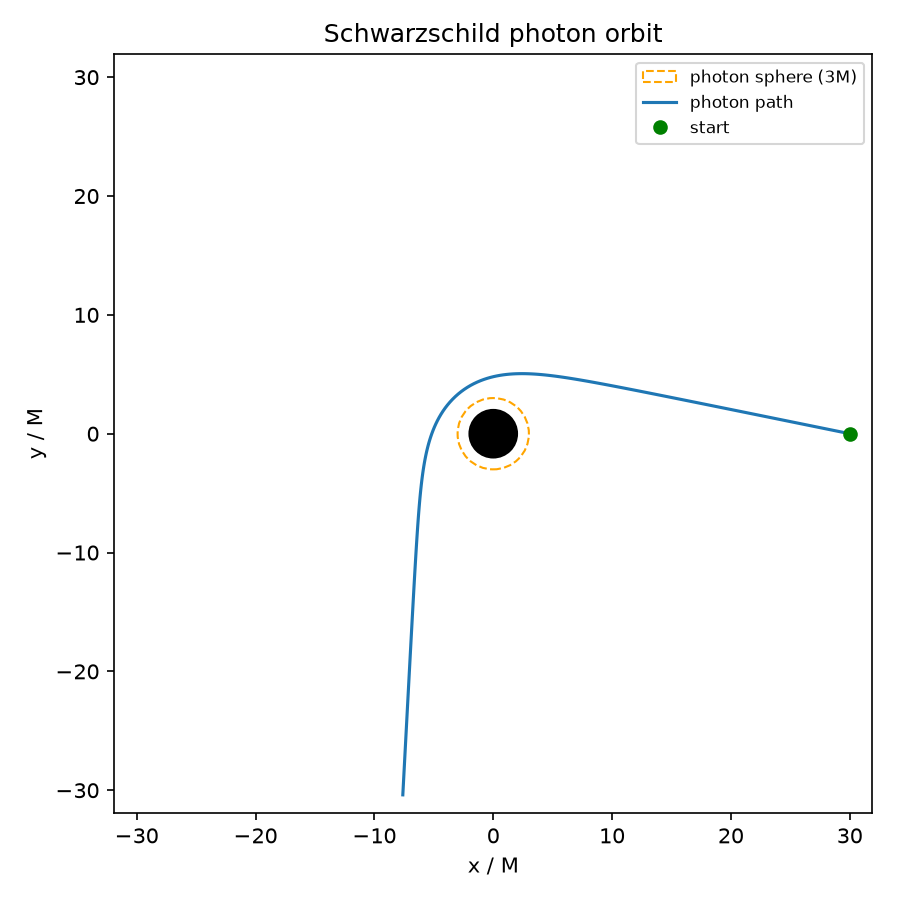
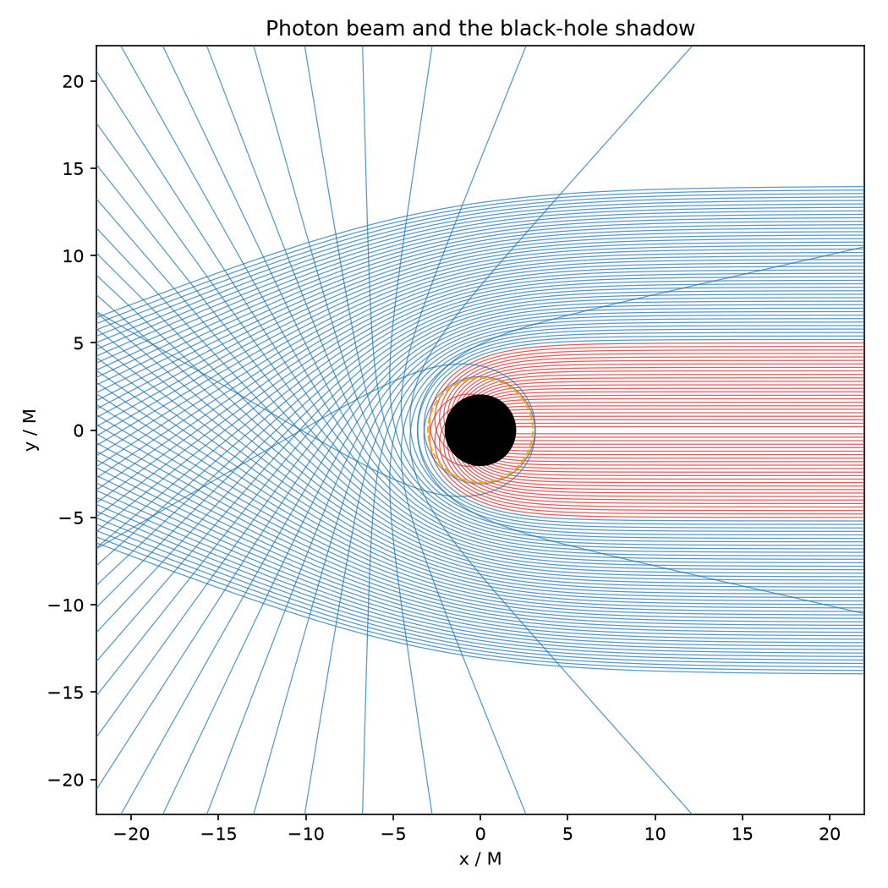
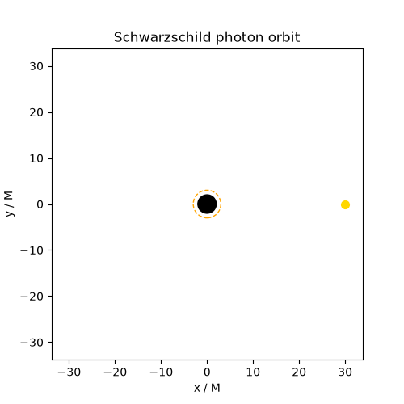
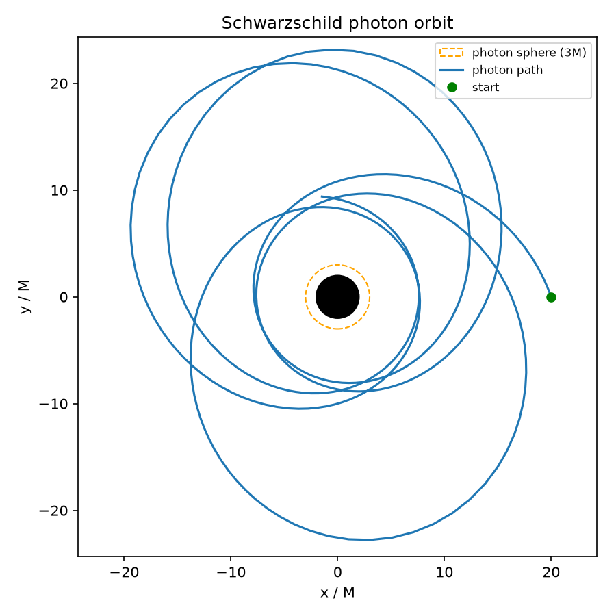
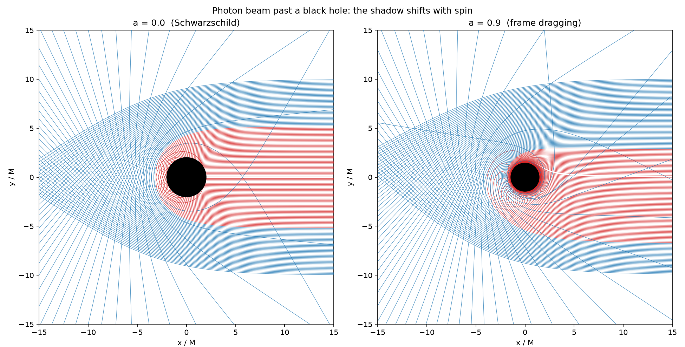

# The black hole simulator

A small, fast C++ engine that traces how light and matter move around a black
hole, together with the tools to test it against known physics and to draw what
it produces. It starts from the simplest case, a non-rotating (Schwarzschild)
black hole, and builds up to a rotating (Kerr) one.

Everything here works in geometrized units, `G = c = 1`, so all lengths and times
are measured in units of the black-hole mass `M`. The metric signature is
(minus, plus, plus, plus).

## Contents

- [Building and running](#building-and-running)
- [Schwarzschild: a non-rotating black hole](#schwarzschild-a-non-rotating-black-hole)
- [How the equations are integrated](#how-the-equations-are-integrated)
- [Kerr: a spinning black hole](#kerr-a-spinning-black-hole)
- [Ray tracing](#ray-tracing)

## Building and running

### Prerequisites

- A C++17 compiler and CMake. On Windows the Visual Studio Build Tools (C++
  workload) provide both; build from the Developer Command Prompt. On Linux or
  macOS any recent g++/clang and cmake work.
- Python 3.10+ for the plotting and animation scripts in `viz/`.

### Build and test

From the repo root:

```
cmake -S simulation -B simulation/build
cmake --build simulation/build --config Release
ctest --test-dir simulation/build --output-on-failure
```

The tests check the integrator against the analytic results listed below (the
critical impact parameter, the photon sphere, the ISCO, weak-field deflection,
and the conserved quantities), and cross-check the Kerr integrator against an
independent MATLAB reference. The executable lands at
`simulation/build/Release/bhsim.exe` (Windows) or `simulation/build/bhsim`.

### Generating trajectories

`bhsim` writes one trajectory as CSV to standard output; the status line goes to
standard error, so only the data reaches the file:

```
bhsim photon 6 30              > orbit.csv     # photon, impact parameter b=6, start r0=30
bhsim photon 5.3 30            > whirl.csv     # just above the capture threshold
bhsim photon 4 30              > capture.csv   # below it: captured
bhsim massive 0.97 4.0 20 1500 > rosette.csv   # bound massive orbit: E, L, r0, lambda_max
bhsim kerr 0.9 6 30            > kerr.csv      # equatorial photon around spin a=0.9
```

On Windows, prefix with the path, for example
`.\simulation\build\Release\bhsim.exe photon 6 30 > orbit.csv`.

### Drawing the results

The scripts in `viz/` read a CSV (or call `bhsim` themselves) and write images
into `simulation/figures/`. They need numpy, matplotlib and imageio, most easily
installed through the project's Python environment:

```
python -m venv .venv
.venv\Scripts\activate          # Windows;  source .venv/bin/activate elsewhere
pip install -e ".[dev]"
```

The individual commands are given next to each figure below.

### Calling the simulator from Python

The integrator can also be called directly from Python, which the machine-learning
side (`../ml/`) uses to generate data. Build the small pybind11 module (this
fetches pybind11 the first time, so it needs a network connection; run it from
the activated environment so CMake finds your Python):

```
cmake -S simulation -B simulation/build -DBHSIM_PYTHON=ON
cmake --build simulation/build --config Release
```

That places a `_bhsim` extension inside `../ml/bhml/`, where `bhml.sim` wraps it.

## Schwarzschild: a non-rotating black hole

A non-rotating, uncharged black hole of mass `M`, in coordinates
$(t, r, \theta, \varphi)$, with its event horizon at $r = 2M$.

### The metric

$$
ds^2 = -\left(1 - \frac{2M}{r}\right)dt^2
       + \left(1 - \frac{2M}{r}\right)^{-1}dr^2
       + r^2\,d\theta^2 + r^2\sin^2\theta\,d\varphi^2
$$

Because the geometry is spherically symmetric, every orbit stays in a single
plane. We lose nothing by working in the equatorial plane $\theta = \pi/2$ and
rotating the result afterward, which keeps the state four-dimensional instead of
eight.

### Conserved quantities

The symmetries in time and azimuth (the Killing vectors $\partial_t$ and
$\partial_\varphi$) give two constants along every orbit:

$$
E = \left(1 - \frac{2M}{r}\right)\frac{dt}{d\lambda},
\qquad
L = r^2 \frac{d\varphi}{d\lambda}.
$$

The normalization $g_{\mu\nu}u^\mu u^\nu = -\varepsilon$ fixes the particle type:
$\varepsilon = 1$ for massive particles (with $\lambda$ the proper time) and
$\varepsilon = 0$ for photons.

### The equations we integrate

Instead of the first-order relation $(dr/d\lambda)^2 = E^2 - V(r)$, which changes
sign at every turning point and needs special handling there, we integrate the
smooth second-order form. The state is $y = (t, r, \varphi, p_r)$ with
$p_r \equiv dr/d\lambda$:

$$
\frac{dt}{d\lambda} = \frac{E}{1 - 2M/r},
\qquad
\frac{dr}{d\lambda} = p_r,
\qquad
\frac{d\varphi}{d\lambda} = \frac{L}{r^2},
$$

$$
\frac{dp_r}{d\lambda}
= -\frac{\varepsilon M}{r^2} + \frac{L^2}{r^3} - \frac{3ML^2}{r^4},
\qquad
V(r) = \left(1 - \frac{2M}{r}\right)\!\left(\varepsilon + \frac{L^2}{r^2}\right).
$$

$E$ and $L$ are set from the starting conditions and then held fixed; watching
them (and the constraint $p_r^2 + V = E^2$) drift is how we check the integrator.

For a photon, only the ratio $b \equiv L/E$ is physical (the affine parameter can
be rescaled), so we set $E = 1$ and $L = b$. A photon coming in from far away
starts with $p_r < 0$, its size fixed by $p_r^2 = E^2 - V(r_0)$.

A single such orbit, bent by gravity as it grazes the hole:



The black disk is the event horizon at $r = 2M$; the dashed ring is the photon
sphere at $r = 3M$ (explained below).
Regenerate with `bhsim photon 6 30 > orbit.csv` then
`python simulation/viz/plot_orbit.py orbit.csv`.

### Circular orbits, the photon sphere, and the ISCO

A circular orbit sits where the radial force vanishes, an extremum of the
effective potential $V(r)$. It is stable at a minimum and unstable at a maximum.

- For photons the only circular orbit is the **photon sphere** at $r = 3M$, and
  it is unstable. That is why a photon aimed near it either spirals in or peels
  away, which produces a sharp capture threshold at the **critical impact
  parameter** $b_\text{crit} = 3\sqrt3\,M \approx 5.196\,M$: below it the photon
  is captured, above it the photon escapes.
- For massive particles, circular orbits exist for $r > 3M$; they are stable
  outside $r = 6M$ and unstable inside it. The boundary $r = 6M$ is the
  **innermost stable circular orbit (ISCO)**, the closest a particle can steadily
  orbit before plunging in.

Firing a whole beam of photons makes the capture threshold visible as a shadow:



Red rays (those with $|b| < 3\sqrt3\,M$) are captured and carve out the dark
shadow; rays just outside the threshold whirl around the photon sphere; the rest
bend away. Regenerate with `python simulation/viz/plot_fan.py`.

A photon launched just above the threshold circles the photon sphere several
times before escaping:



Regenerate with `bhsim photon 5.3 30 > whirl.csv` then
`python simulation/viz/animate_orbit.py whirl.csv`.

A bound massive orbit does not close on itself the way a Newtonian ellipse does:



This is a bound particle ($E = 0.97$, $L = 4.0M$) oscillating between
$r \approx 7.6M$ and $23M$. Its slow rotation is relativistic perihelion
precession, the same effect first measured for Mercury. Regenerate with
`bhsim massive 0.97 4.0 20 1500 > rosette.csv` then
`python simulation/viz/plot_orbit.py rosette.csv simulation/figures/rosette.png`.

### What the tests check

| Quantity | Value | Meaning |
| --- | --- | --- |
| Photon sphere | $r = 3M$ | unstable circular light orbit |
| Critical impact parameter | $b_\text{crit} = 3\sqrt3\,M \approx 5.196\,M$ | capture threshold for photons |
| ISCO | $r = 6M$ | innermost stable circular orbit (massive) |
| Weak-field deflection | $\delta\varphi \to 4M/b$ | Einstein's light bending at large $b$ |
| $E$, $L$ | constant | bounded drift over a long integration |

The deflection has a known weak-field series,

$$
\delta\varphi = \frac{4M}{b} + \frac{15\pi}{4}\left(\frac{M}{b}\right)^2 + \cdots,
$$

whose first term is Einstein's result. The code is checked against the leading
term at large $b$ and against the two-term series at finite $b$.

## How the equations are integrated

The geodesic system $dy/d\lambda = f(y)$ has no closed-form solution in general,
so it is advanced numerically with explicit Runge-Kutta methods.

The simplest method, Euler's, walks straight along the current slope,
$y_{n+1} = y_n + h\,f(y_n)$. It is easy but inaccurate, because the slope changes
during the step; its error per step grows like $h^2$.

**RK4** samples the slope four times across each step and takes a weighted
average:

$$
k_1 = f(y_n), \;
k_2 = f\!\left(y_n + \tfrac{h}{2}k_1\right), \;
k_3 = f\!\left(y_n + \tfrac{h}{2}k_2\right), \;
k_4 = f\!\left(y_n + h\,k_3\right),
$$

$$
y_{n+1} = y_n + \frac{h}{6}\left(k_1 + 2k_2 + 2k_3 + k_4\right).
$$

Its error per step falls like $h^5$, so halving the step cuts the error about
sixteenfold. With RK4 at $h = 0.01$ the conserved constraint holds to roughly
$10^{-14}$, machine precision.

**Adaptive RK45 (Dormand-Prince).** A fixed step is wasteful: an orbit needs tiny
steps near the hole and can take large ones far away. An embedded Runge-Kutta
pair computes a fifth-order and a fourth-order estimate from the same work; their
difference estimates the local error. That error, scaled by absolute and relative
tolerances, decides whether to accept the step and how big to make the next one.
These are the same coefficients behind MATLAB's `ode45`, and this is the method
the visualizations and data generation use.

## Kerr: a spinning black hole

A rotating black hole of mass `M` and spin $a = J/M$, with $0 \le a \le M$
($a = M$ is the extremal, fastest-spinning case). At $a = 0$ it reduces exactly to
Schwarzschild, which is the first thing the tests verify.

### The metric (Boyer-Lindquist)

With the shorthands $\Sigma = r^2 + a^2\cos^2\theta$ and
$\Delta = r^2 - 2Mr + a^2$,

$$
ds^2 = -\left(1 - \frac{2Mr}{\Sigma}\right)dt^2
       - \frac{4Mar\sin^2\theta}{\Sigma}\,dt\,d\varphi
       + \frac{\Sigma}{\Delta}\,dr^2 + \Sigma\,d\theta^2
       + \left(r^2 + a^2 + \frac{2Ma^2r\sin^2\theta}{\Sigma}\right)\sin^2\theta\,d\varphi^2.
$$

The cross term $dt\,d\varphi$ is **frame dragging**: rotation ties time to
azimuth, so there is no way to sit still near the hole. The horizons are at
$\Delta = 0$, giving the event horizon $r_+ = M + \sqrt{M^2 - a^2}$. Spin also
breaks the planar symmetry, so orbits are genuinely three-dimensional and the
state grows to eight components.

### Conserved quantities

Energy and axial angular momentum are still conserved, $E = -p_t$ and
$L_z = p_\varphi$, and Kerr has a third constant, **Carter's constant** $Q$, from
a hidden symmetry. It separates the polar motion and gives a third independent
check on the integration.

### The equations we integrate (Hamiltonian form)

Rather than the roughly forty Christoffel symbols of the second-order geodesic
equation, we integrate Hamilton's equations for the super-Hamiltonian
$H = \tfrac12 g^{\mu\nu}p_\mu p_\nu$ (fixed at $0$ for photons, $-\tfrac12$ for
massive particles), on the state
$y = (t, r, \theta, \varphi,\; p_t, p_r, p_\theta, p_\varphi)$:

$$
\frac{dx^\mu}{d\lambda} = g^{\mu\nu} p_\nu,
\qquad
\frac{dp_\mu}{d\lambda} = -\tfrac12\,(\partial_\mu g^{\alpha\beta})\,p_\alpha p_\beta.
$$

This needs only the inverse metric and its derivatives, not Christoffel symbols.
Because the metric depends on $r$ and $\theta$ only, $p_t$ and $p_\varphi$ are
automatically constant. The five nonzero inverse-metric components and their
$r$- and $\theta$-derivatives are derived symbolically in MATLAB
(`matlab/derive_kerr.m`, needs the Symbolic Math Toolbox) and exported as the C++
header `include/kerr_generated.hpp`. The same script also produces an independent
`ode113` reference trajectory that the C++ integrator is tested against; the two
agree to about $10^{-11}$ over a long orbit.

### What the tests check

| Quantity | Value | Notes |
| --- | --- | --- |
| Outer horizon | $r_+ = M + \sqrt{M^2 - a^2}$ | goes to $2M$ at $a=0$, to $M$ when extremal |
| Photon orbit (prograde) | $2M\{1 + \cos[\tfrac{2}{3}\arccos(-a/M)]\}$ | goes to $3M$ at $a=0$, to $M$ extremal |
| Photon orbit (retrograde) | $2M\{1 + \cos[\tfrac{2}{3}\arccos(+a/M)]\}$ | goes to $3M$ at $a=0$, to $4M$ extremal |
| $a = 0$ limit | Schwarzschild | trajectories match the Schwarzschild code |
| $E$, $L_z$, $Q$, $H$ | constant | bounded drift over a long integration |

### Seeing the spin

Frame dragging makes the shadow lopsided. Compared with a non-spinning hole, the
capture region of a spinning one is pushed off-center: co-rotating (prograde)
rays thread closer and escape, while counter-rotating ones are swept in from
farther out.



Regenerate with `python simulation/viz/plot_kerr_fan.py`.

Sweeping the spin from $a = 0$ up to $0.99$, the horizon shrinks
($r_+ = M + \sqrt{M^2 - a^2}$) and the capture region slides off-center as frame
dragging strengthens:


Regenerate with `python simulation/viz/animate_kerr_spin.py`.

## Ray tracing

Shooting one ray per pixel back from a camera through the geometry, to render an
actual image of a black hole with an accretion disk (the lensed disk, photon
ring, and shadow). The Kerr integrator is already fully three-dimensional, which
is what an inclined camera view needs. tba.
